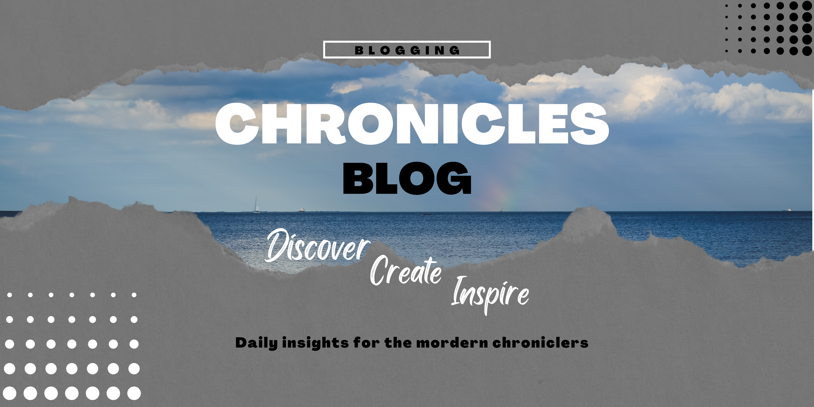
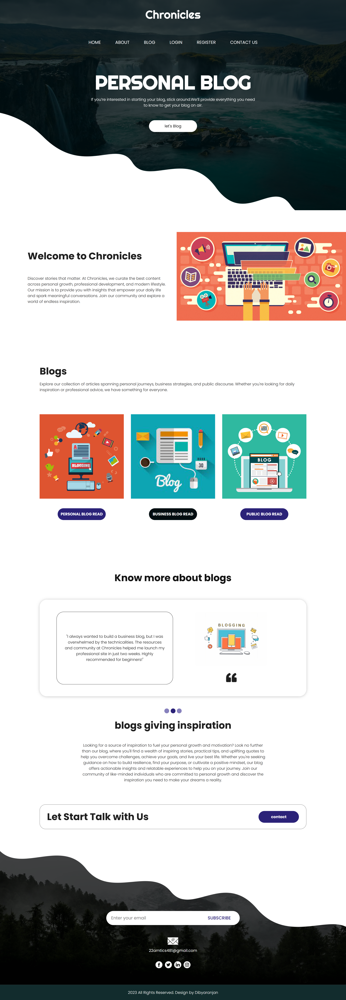
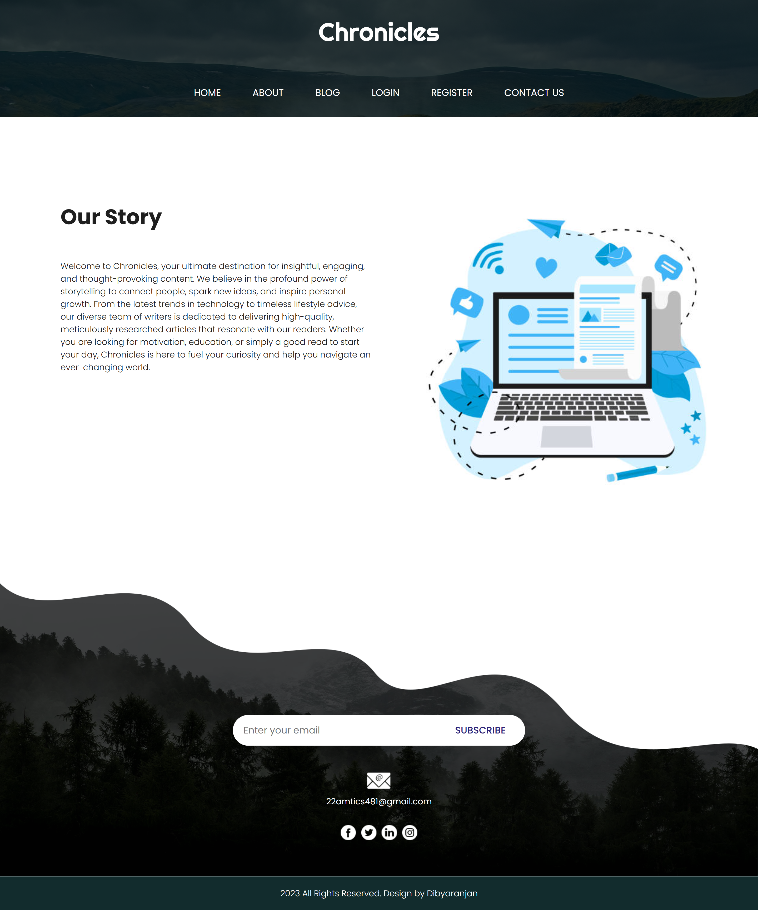
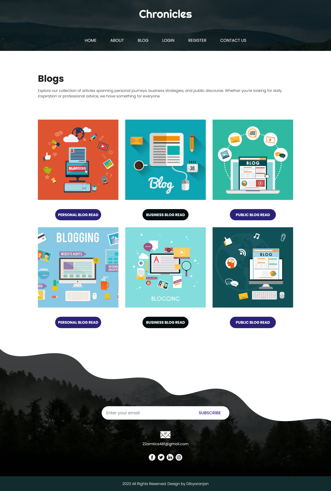
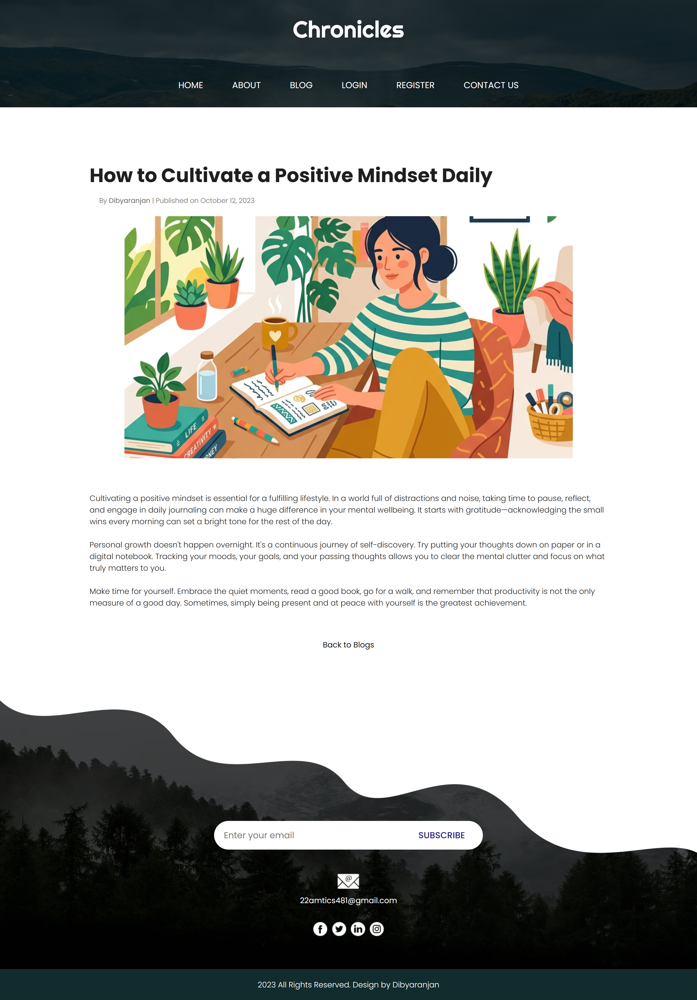
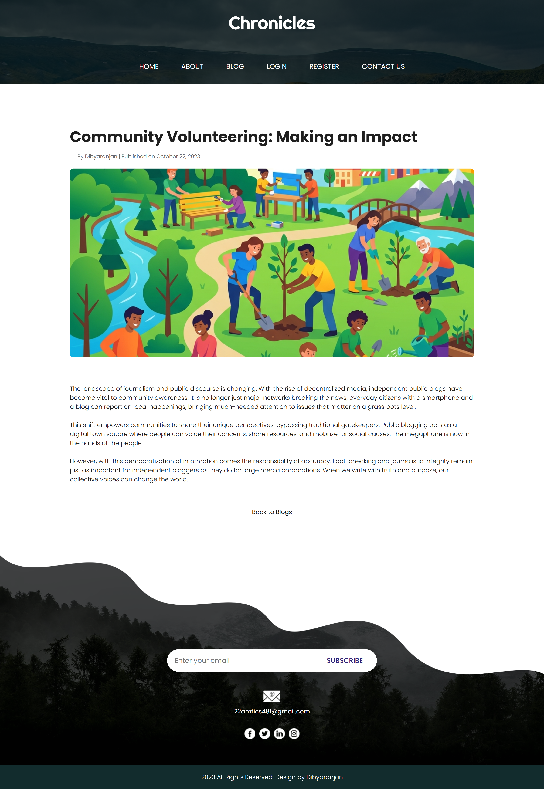
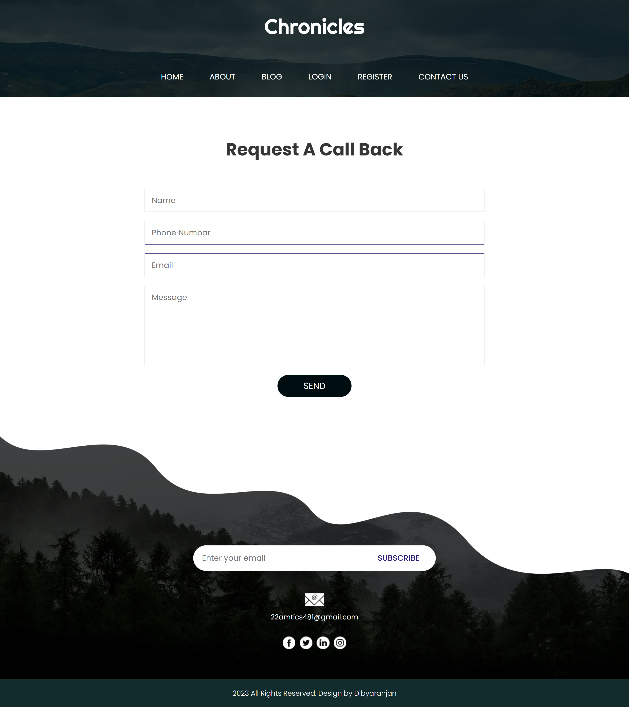
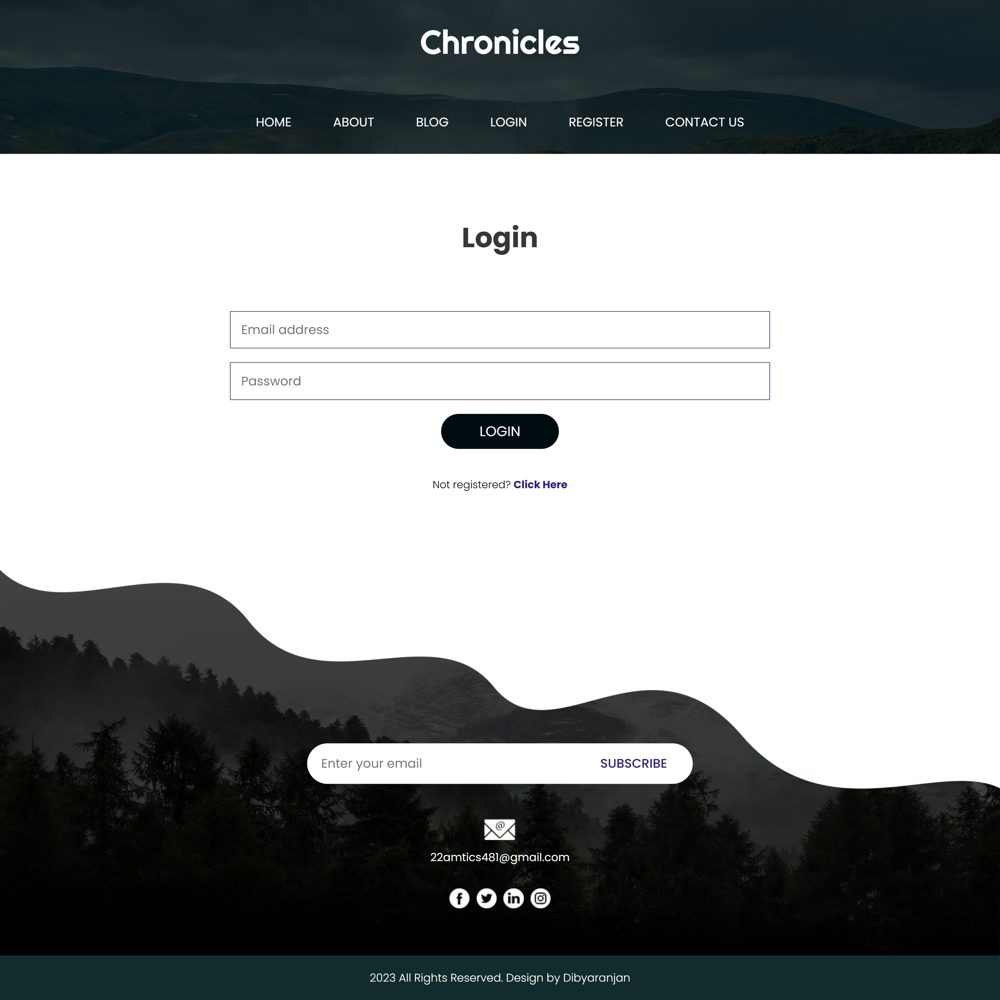
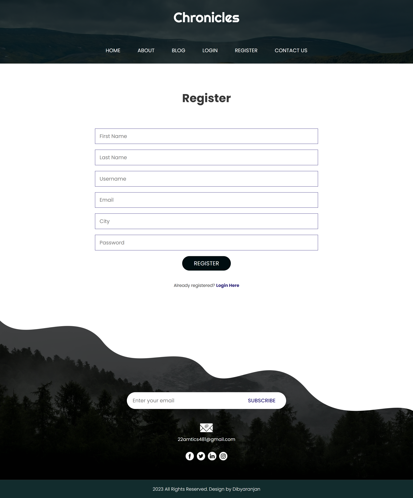

<div align="center">
  
</div>

<h1 align="center">✍️ Chronicles Blog 🌍</h1>

<p align="center">
  A modern, responsive, and beautifully designed blog template featuring distinct categories for Personal, Business, and Public reading.
</p>

<div align="center">
  
  
  
</div>


---

## 📖 Table of Contents
- [The Story Behind This Project](#-the-story-behind-this-project)
- [Screenshots](#-screenshots)
- [Key Features](#-key-features)
- [Tech Stack](#-tech-stack)
- [Installation and Usage](#-installation-and-usage)
- [File Structure](#-file-structure)
- [Contribution](#-contribution)
- [License](#-license)
- [Author](#-author)

---

## 📜 The Story Behind This Project

This project originally started as a standard college assignment where I had to build a website using basic HTML and CSS. I could have just thrown together a simple template and called it a day, but I genuinely wanted to create something that looked like a real, premium platform.

I recently went back to it and completely polished it up. I restructured the layouts, added custom vector illustrations for the different blog categories, fixed a bunch of responsive mobile issues, and implemented a sleek, consistent dark theme for the authentication pages (Login & Register). It's really cool seeing how a simple assignment can transform into a professional-looking frontend with just some careful styling and attention to detail.

If you like how it turned out, feel free to drop a **star ⭐** or **fork it 🍴**!

---

## 🖥️ Screenshots

<div align="center">
  <table>
    <tr>
      <td align="center">
        
        <br/>
        <em>Homepage & Welcome Section</em>
      </td>
      <td align="center">
        
        <br/>
        <em>About Page</em>
      </td>
    </tr>
    <tr>
      <td align="center">
        
        <br/>
        <em>Blog Category Listings</em>
      </td>
      <td align="center">
        
        <br/>
        <em>Detailed Blog Reading View</em>
      </td>
    </tr>
    <tr>
      <td align="center">
        
        <br/>
        <em>Detailed Blog Reading View 2</em>
      </td>
      <td align="center">
        
        <br/>
        <em>Contact Us Page</em>
      </td>
    </tr>
    <tr>
      <td align="center">
        
        <br/>
        <em>Premium Dark Login Page</em>
      </td>
      <td align="center">
        
        <br/>
        <em>Premium Dark Registration Page</em>
      </td>
    </tr>
  </table>
</div>

---

## 📌 Key Features

- 📱 **Fully Responsive:** Adapts cleanly to mobile phones, tablets, and desktops using Bootstrap's grid system and custom CSS tweaks.
- 🎨 **Category-Specific Pages:** Dedicated reading pages for Personal, Business, and Public blogs, each with their own unique vector illustrations.
- 🔒 **Sleek Auth Pages:** Login and Registration pages completely redesigned to match the site's dark, premium aesthetic.
- 🖼️ **Modern UI/UX:** Pill-shaped buttons, engaging hover effects, and a clean structural hierarchy that prioritizes the welcome message and content discovery.

---

## 🛠️ Tech Stack

- **Structure:** HTML5
- **Styling:** CSS3 & Bootstrap (for grids, carousels, and rapid UI development)
- **Logic & Interactions:** Vanilla JavaScript (for carousel and navbar toggles)
- **Images:** Custom AI-generated flat vector illustrations and curated placeholder photography.

---

## 🚀 Installation and Usage

Since this is a vanilla frontend application without a complex backend, getting it running is extremely simple. 
*(Note: A Node.js backend might be added in the future!)*

### **1. Clone the Repository**
```sh
git clone https://github.com/Dibyaranjan27/chronicles-blog.git
cd chronicles-blog
```

### **2. Open Locally**
Simply open the `index.html` file in your preferred web browser. 
No local server or installation is strictly necessary, though you can use tools like VS Code's "Live Server" extension for hot-reloading if you plan to make edits.

---

## 📂 File Structure

```text
/chronicles-blog
│
├── index.html              # The main landing and welcome page
├── blog.html               # The blog listing page with 6 distinct articles
├── personal-blog.html      # Specific personal blog posts
├── business-blog.html      # Specific business blog posts
├── public-blog.html        # Specific public blog posts
├── login.html              # Dark-themed user login
├── register.html           # Dark-themed user registration
├── contact.html            # Contact and inquiry form
├── css/
│   └── style.css           # Core custom styles and responsive tweaks
├── images/                 # Contains all logos, vectors, and UI graphics
└── README.md               # This file
```

---

## 🤝 Contribution

Feel free to contribute to this project! Fork the repository, make your improvements, and submit a pull request. All contributions are welcome.

If you have any questions or suggestions, feel free to contact me. I'd be happy to help! 😊

---

## 📜 License

This project is open-source and available under the MIT License.

---

## 💡 Author

<p align="center">
<em>Crafted with pixels & passion by</em>
<br>
<strong>Dibyaranjan Maharana</strong>
<br>
<a href="https://github.com/Dibyaranjan27">GitHub</a> | <a href="https://www.linkedin.com/in/dibyaranjan-maharana-1228012b2/">LinkedIn</a>
</p>
