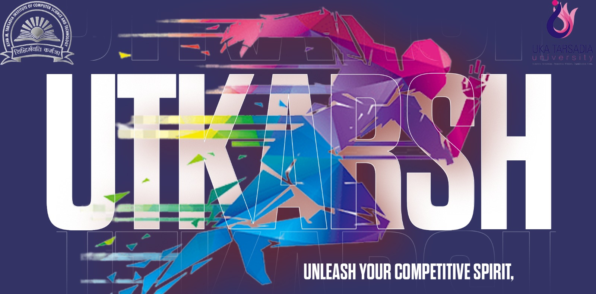
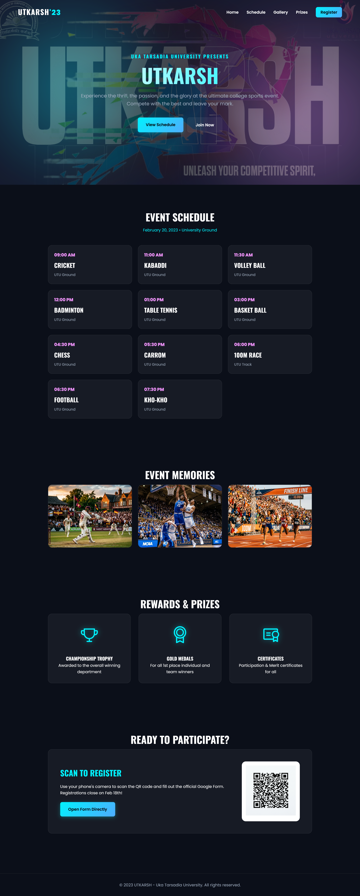

<div align="center">
  
</div>

<h1 align="center">🏆 UTKARSH '23 🏃‍♂️</h1>

<p align="center">
  A modern, dynamic, and visually stunning web page for the "UTKARSH" sports event at Uka Tarsadia University. 
</p>

<div align="center">
  
  
  
</div>


---

## 📖 Table of Contents
- [The Story Behind This Project](#-the-story-behind-this-project)
- [Screenshots](#-screenshots)
- [Key Features](#-key-features)
- [Tech Stack](#-tech-stack)
- [Installation and Usage](#-installation-and-usage)
- [File Structure](#-file-structure)
- [Contribution](#-contribution)
- [License](#-license)
- [Author](#-author)

---

## 📜 The Story Behind This Project

So this started as just a college assignment—literally just a basic HTML table with event schedules. It sat in my drive for years, and honestly, it was pretty rough. But recently I decided to dust it off and actually make it into something I'd be proud to show people.

I ended up redoing the whole thing from scratch. Added a dark theme because why not, threw in some glassmorphism effects, smooth scroll animations, better images... basically took a boring schedule table and made it look like an actual modern event page. It was fun seeing how much better something can look with just some CSS and JavaScript.

*The photos and background images are placeholder high-quality images to show what the final design could look like.*

If you think it turned out cool, feel free to drop a **star ⭐** or **fork it 🍴**!

---

## 🖥️ Screenshots

<div align="center">
  <table>
    <tr>
      <td align="center">
        
        <br/>
        <em>Full view of the Webpage</em>
      </td>
    </tr>
  </table>
</div>

---

## 📌 Key Features

- 🏅 **Dynamic Schedule Cards:** Replaced the old standard table with modern, responsive glassmorphism cards.
- ✨ **Scroll Animations:** Smooth fade-in effects as you scroll down the page, created using vanilla JavaScript's `IntersectionObserver`.
- 🎨 **Modern UI/UX:** A sleek dark theme with vibrant neon accents, floating background blobs, and custom typography (Oswald and Poppins).
- 🖼️ **Interactive Gallery:** A beautiful layout for event memories and photos with elegant hover zoom effects.
- 📱 **Responsive Design:** Adapts cleanly to various screen sizes, ensuring the event notice looks great on mobile phones and desktops.
- 📸 **QR Code Registration:** A modern registration block containing a scannable QR code to link to event Google Forms.

---

## 🛠️ Tech Stack

- **Structure:** HTML5
- **Styling:** Vanilla CSS3 (Custom Properties, Flexbox, Grid, Glassmorphism)
- **Logic & Interactions:** Vanilla JavaScript
- **Icons:** Phosphor Icons
- **Fonts:** Google Fonts (Poppins & Oswald)

---

## 🚀 Installation and Usage

Since this is a vanilla web application without any build tools or complex backend requirements, getting it running is extremely simple.

### **1. Clone the Repository**
```sh
git clone https://github.com/Dibyaranjan27/utkarsh-sports-event.git
cd utkarsh-sports-event
```

### **2. Open Locally**
Simply open the `index.html` file in your preferred web browser. 
No local server or installation is strictly necessary, though you can use tools like VS Code's "Live Server" extension for hot-reloading if you plan to make edits.

---

## 📂 File Structure

```text
/utkarsh-sports-event
│
├── index.html              # The main HTML structure
├── styles.css              # Custom CSS styles
├── script.js               # Vanilla JS for scroll animations
├── hero_bg.png             # Background image for the Hero section
├── gallery_1.png           # Gallery image (Cricket)
├── gallery_2.png           # Gallery image (Basketball)
├── gallery_3.png           # Gallery image (Sprint)
├── qr_code.png             # Registration QR code
└── README.md               # This file
```

---

## 🤝 Contribution

Feel free to contribute to this project! Fork the repository, make your improvements, and submit a pull request. All contributions are welcome.

If you have any questions or suggestions, feel free to contact me. I'd be happy to help! 😊

---

## 📜 License

This project is open-source and available under the MIT License.

---

## 💡 Author

<p align="center">
<em>Crafted with pixels & passion by</em>
<br>
<strong>Dibyaranjan Maharana</strong>
<br>
<a href="https://github.com/Dibyaranjan27">GitHub</a> | <a href="https://www.linkedin.com/in/dibyaranjan-maharana-1228012b2/">LinkedIn</a>
</p>
